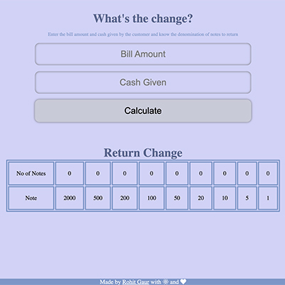

# What's the Change?

It is a web app made with React. Enter the bill amount and cash paid, it will tell you how much change is to be returned to the customer with the minimum number of notes.

### Website: [What's the Change?](https://nyopx.csb.app/)
